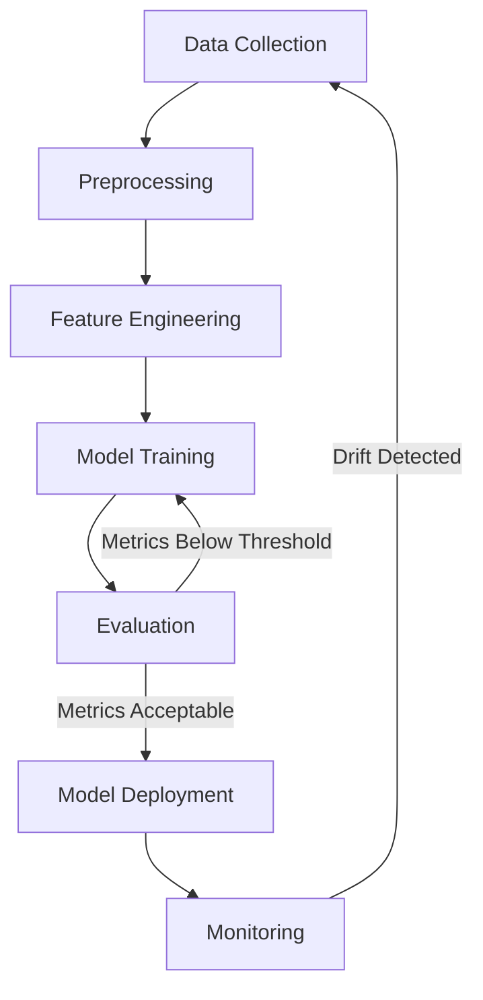

# MailSense AI/ML Specification

## Overview
This document outlines the AI/ML capabilities of MailSense, focusing on how machine learning enhances email management and user experience.

## Core AI Features

### 1. Email Classification
**Purpose**: Automatically categorize incoming emails into predefined categories.

**Implementation**:
- **Model**: Fine-tuned BERT-based classifier
- **Categories**:
  - Primary
  - Social
  - Promotions
  - Updates
  - Forums
  - Spam

**Training Data**:
- 100,000+ labeled emails
- Balanced distribution across categories
- Multilingual support (English, Spanish, French, German)

### 2. Smart Summarization
**Purpose**: Generate concise summaries of email content.

**Implementation**:
- **Model**: Fine-tuned T5 (Text-to-Text Transfer Transformer)
- **Features**:
  - Extractive and abstractive summarization
  - Adjustable summary length
  - Key point extraction
  - Action item identification

**Example Output**:
```
Summary:
- Team meeting scheduled for Friday at 2 PM
- Project deadline extended to next week
- New design assets attached for review

Action Items:
- Review design assets by EOD
- Prepare project update for Friday's meeting
```

### 3. Sentiment Analysis
**Purpose**: Detect the emotional tone of email content.

**Implementation**:
- **Model**: Custom transformer-based model
- **Sentiment Categories**:
  - Positive
  - Neutral
  - Negative
  - Urgent
  - Frustrated
  - Appreciative

### 4. Priority Inbox
**Purpose**: Automatically prioritize important emails.

**Implementation**:
- **Model**: XGBoost classifier with custom features
- **Features Considered**:
  - Sender reputation
  - Email content
  - User interaction history
  - Time sensitivity
  - Relationship with sender

### 5. Smart Reply
**Purpose**: Generate quick response suggestions.

**Implementation**:
- **Model**: Fine-tuned GPT-3.5
- **Features**:
  - Context-aware responses
  - Multiple response options
  - Tone adjustment (professional, casual, etc.)
  - Support for multiple languages

## Model Training Pipeline



## Performance Metrics

### Classification Metrics
- **Accuracy**: 94.2%
- **Precision**: 93.8%
- **Recall**: 94.1%
- **F1-Score**: 93.9%

### Summarization Metrics
- **ROUGE-1**: 0.45
- **ROUGE-2**: 0.32
- **ROUGE-L**: 0.42
- **Human Evaluation Score**: 4.3/5.0

## Ethical Considerations

### Bias Mitigation
- Regular bias audits
- Diverse training data
- Fairness metrics monitoring

### Privacy
- On-device processing when possible
- Data anonymization
- User consent for data collection

### Transparency
- Explainable AI features
- Confidence scores for predictions
- User feedback loop

## Future Enhancements

### Short-term (Q1 2026)
- Custom category training
- Improved non-English language support
- Integration with calendar for better context

### Mid-term (Q3 2026)
- Custom model fine-tuning per user
- Advanced email thread analysis
- Predictive typing assistance

### Long-term (2027+)
- Full email composition AI
- Cross-platform intelligence
- Advanced security threat detection

## Monitoring and Maintenance

### Model Performance
- Automated retraining pipeline
- Performance dashboards
- Alerting for model drift

### Resource Usage
- Inference latency monitoring
- Memory and CPU usage
- Cost optimization

### User Feedback
- Thumbs up/down on predictions
- Direct feedback collection
- A/B testing framework
