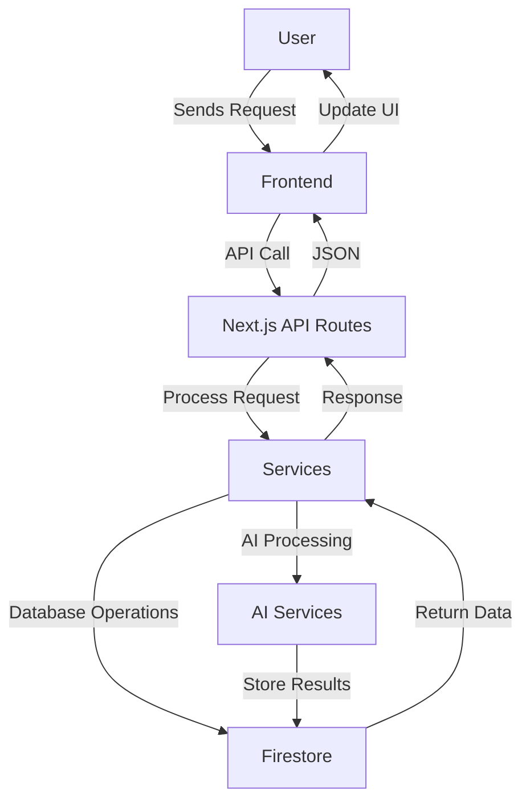

# MailSense Architecture

## System Overview

MailSense is a modern email management platform powered by AI to enhance productivity and email intelligence. The system is built with a microservices architecture for scalability and maintainability.

## Core Components

### 1. Frontend
- **Framework**: Next.js 14 with React 18
- **State Management**: React Query + Zustand
- **UI Components**: Shadcn UI with Tailwind CSS
- **Real-time Updates**: WebSockets for live notifications

### 2. Backend
- **Runtime**: Node.js with TypeScript
- **API Layer**: Next.js API Routes
- **Authentication**: NextAuth.js with JWT
- **Database**: Firebase Firestore
- **AI Services**: Integration with OpenAI and custom NLP models

### 3. AI/ML Components
- Email Classification
- Smart Summarization
- Sentiment Analysis
- Priority Inbox
- Automated Responses

## Data Flow

## Security Considerations

- End-to-end encryption for sensitive data
- Rate limiting on API endpoints
- CORS policy enforcement
- Regular security audits
- Dependency vulnerability scanning

## Performance Optimizations

- Server-side rendering with ISR
- Image optimization
- Code splitting
- Caching strategies
- Database indexing

## Monitoring and Logging

- Error tracking with Sentry
- Performance monitoring
- User analytics
- Audit logs

## Deployment

- Vercel for frontend hosting
- Firebase for backend services
- CI/CD with GitHub Actions
- Environment-based configuration

## Future Enhancements

- Mobile application
- Browser extensions
- Advanced analytics dashboard
- Integration with other productivity tools
- Custom AI model training
